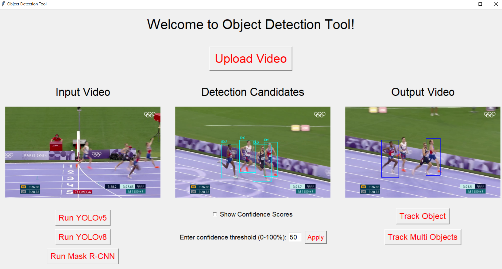

# Multi‑Model Object Detection and Tracking Tool with Real‑Time GUI

A Python Tkinter‑based computer vision application integrating **YOLOv5**, **YOLOv8**, and **Mask R‑CNN** for object detection, with advanced single/multi‑object tracking capabilities. Includes an intuitive real‑time GUI for video analysis and monitoring.


---

## 🚀 Features

### Multi‑Model Detection
- **YOLOv5 Integration** — fast & accurate object detection
- **YOLOv8 Support** — latest YOLO architecture
- **Mask R‑CNN** — instance segmentation with high precision
- **Easily switch** between models from the GUI

### Object Tracking
- **CSRT Tracker** for robust single or multi‑object tracking
- Confidence‑based object filtering
- Robust performance under occlusion or lighting changes

### GUI Highlights
- Built using **Tkinter**
- Three‑panel display: input, detection preview, and tracking output
- Real‑time video playback with threading (non‑blocking GUI)
- Adjustable detection confidence threshold
- Optional confidence score overlays

---

## 🖥️ Example GUI

<p align="center">
  
</p>

---

## 📋 Requirements

Core dependencies listed in `requirements.txt`:

```bash
opencv-python>=4.5.0
torch>=1.9.0
torchvision>=0.10.0
ultralytics>=8.0.0
Pillow>=8.0.0
numpy>=1.21.0
matplotlib>=3.3.0
```

> Install all dependencies with:
```bash
pip install -r requirements.txt
```

---

## 🚀 Installation

1. **Clone the repository**
```bash
git clone https://github.com/yourusername/multi-model-object-detection-tracking.git
cd multi-model-object-detection-tracking
```

2. **(Optional) Create a virtual environment**
```bash
python -m venv venv
# Activate:
# Linux/macOS:
source venv/bin/activate
# Windows:
venv\Scripts\activate
```

3. **Install dependencies**
```bash
pip install -r requirements.txt
```

4. **Download model weights**  
   - **YOLOv5 & YOLOv8** weights are automatically downloaded on first use  
   - **Mask R‑CNN** weights are provided by `torchvision` on first use

---

## 🎬 Usage

### Launch the GUI
```bash
python GUI.ipynb
```
> If using Jupyter, open `GUI.ipynb` and run all cells to start the application.

### Running the Application
1. Upload a video file (MP4, AVI, MOV) — sample clips are available in the `Test_Videos/` folder.
2. Select a detection model:
   - **YOLOv5**
   - **YOLOv8**
   - **Mask R‑CNN**
3. Adjust confidence threshold (0–100%).
4. Perform object detection.
5. Choose tracking mode:
   - **Single Object Tracking** — select object ID
   - **Multi‑Object Tracking** — enter multiple IDs or use “all”
6. View results in the tracking output panel.

---

## 📂 Repository Structure

```
project/
├── Test_Videos/        # Sample videos for testing
├── readme_images/      # Images used in README
├── GUI.ipynb           # Main application (Tkinter GUI + detection/tracking)
├── requirements.txt    # Dependencies
└── README.md           # Project documentation
```

---

## 🤝 Contributing

Contributions are welcome! Please open a **Pull Request** for changes.  
For major changes or new features, open an **Issue** first to discuss the idea.

---

⭐ If you find this project useful, consider starring it on GitHub!
